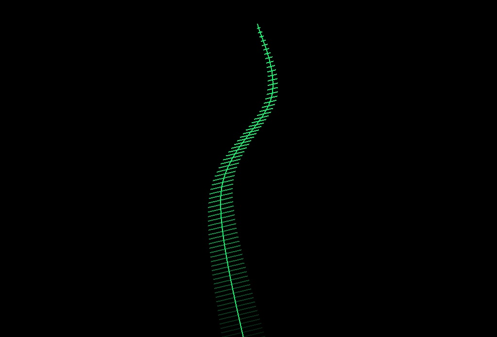

## A Lovely Strand of Dancing Seaweed

This program simulates a dancing strand of lovely, green seaweed on a black background. It uses polylines and normals to create the strand and its feathers, and then cosines to move it around in its own, little dance. 

To enjoy, just open it in Visual Studios and press Play.

